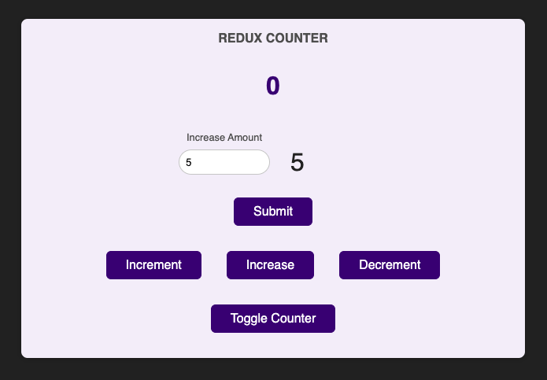

# Counter Redux

A simple counter app using redux.

## Tech Stack

## Screenshots

## Lessons Learned

What did you learn while building this project? What challenges did you face and how did you overcome them?

- I practiced managing state using redux. It all clicked today and made a lot of sense. I took my time and took good notes, and now I think I'm ready to move on to more advanced redux projects!

- I learned how react-redux is written with and without reduxjs/toolkit. And I see why the toolkit is so useful

- I struggled to get the increaseAmount input working with redux. I discovered that the best way to handle state that's isolated to a component, like with user input is through useState(), and then sending the form data to redux on submit.

- I also spent some time reconfiguring my hotkeys in VSCode. I'm determined to use the mouse less and less everyday. And also to make my most used keybindings easy to press.

## Acknowledgements

- [readme.so](https://readme.so/editor)
- [Udemy - react-the-complete-guide-incl-redux](https://www.udemy.com/course/react-the-complete-guide-incl-redux/)
- [Simple Icons](https://simpleicons.org/?q=redux)
- [shields.io](https://shields.io/)
